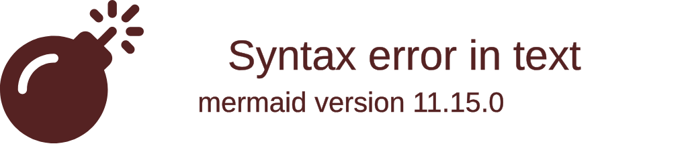
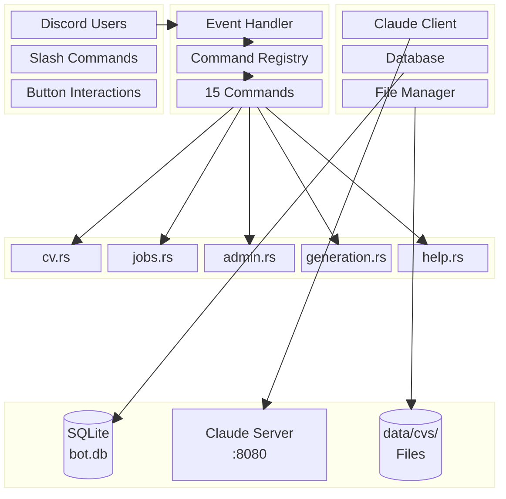
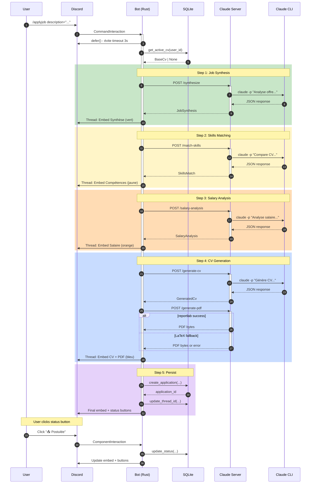
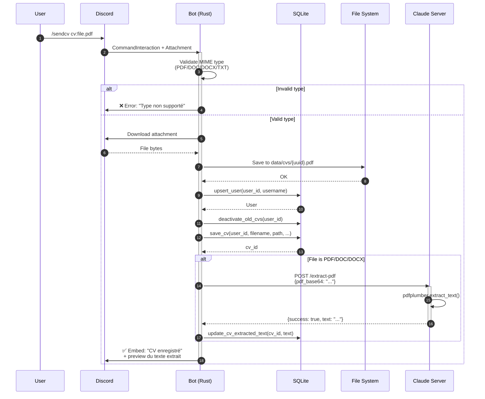
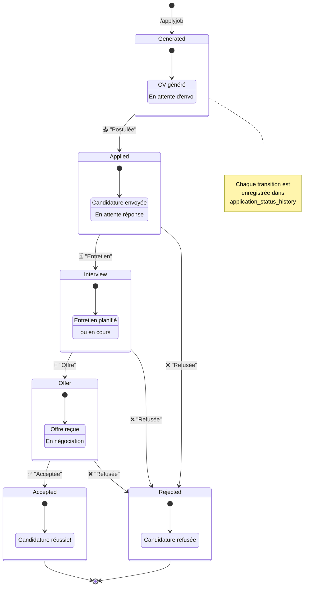
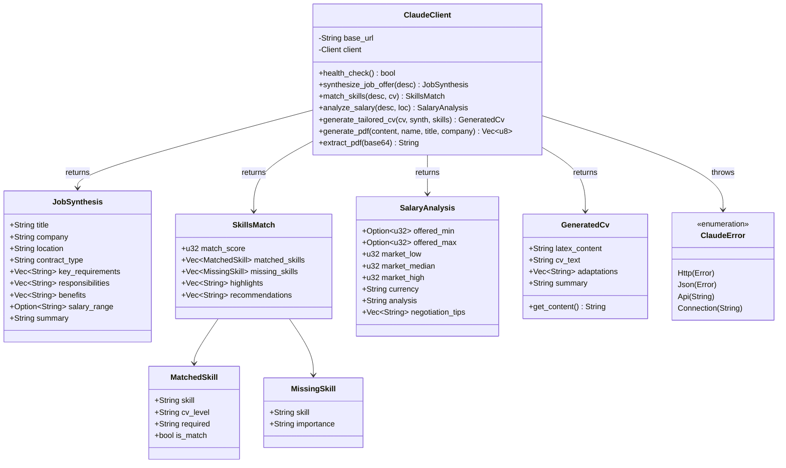
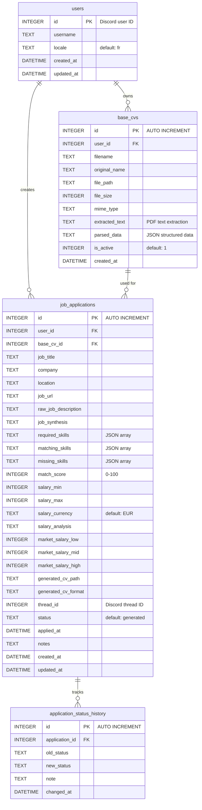
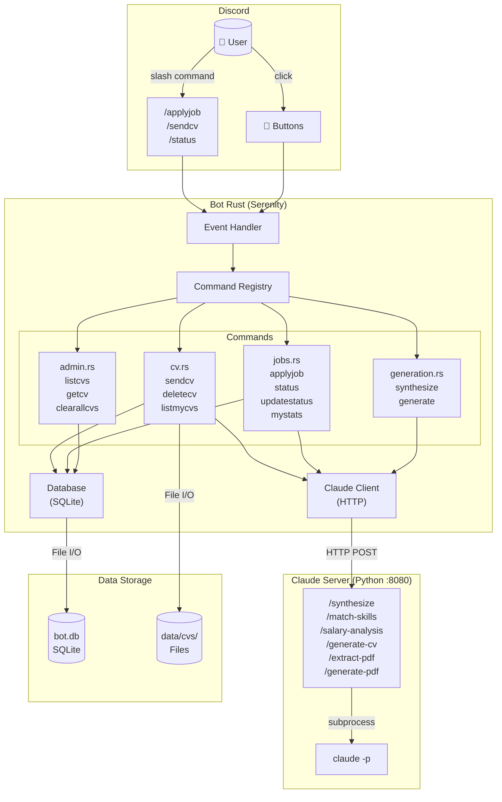
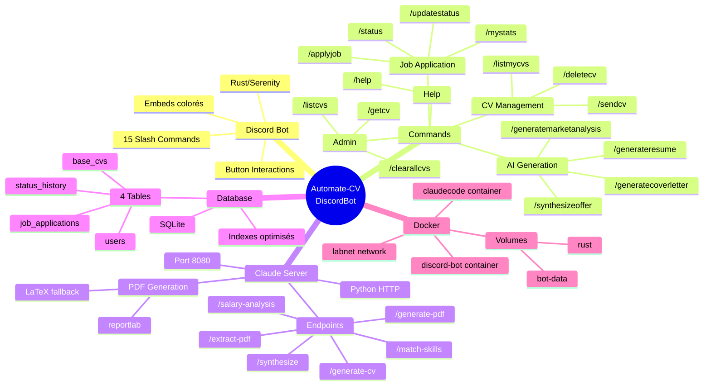
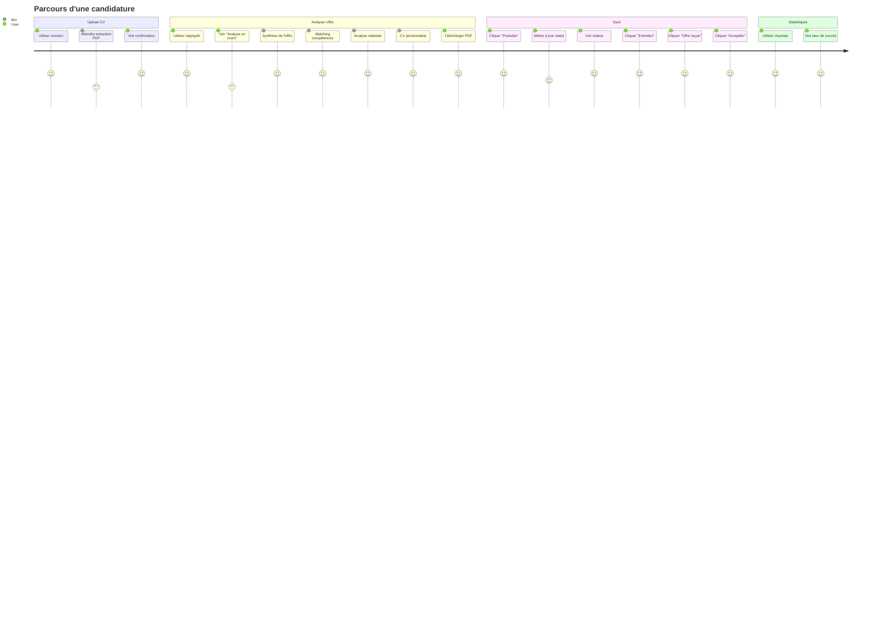

# Diagrammes d'Architecture - Automate-CV-DiscordBot

Ce document contient les diagrammes d'architecture du projet au format **Mermaid**.

> **Rendu:** Ces diagrammes sont compatibles avec GitHub, GitLab, VS Code, Notion, Obsidian et [Mermaid Live Editor](https://mermaid.live).

## Table des matières

1. [Architecture Système (Beta)](#1-architecture-système-beta)
2. [Block Diagram - Composants (Beta)](#2-block-diagram---composants-beta)
3. [Diagramme de Séquence - ApplyJob](#3-diagramme-de-séquence---applyjob)
4. [Diagramme de Séquence - SendCV](#4-diagramme-de-séquence---sendcv)
5. [Diagramme d'États - Application Status](#5-diagramme-détats---application-status)
6. [Diagramme de Classes - Structures de Données](#6-diagramme-de-classes---structures-de-données)
7. [Diagramme Entité-Relation (ERD)](#7-diagramme-entité-relation-erd)
8. [Flowchart - Workflow Principal](#8-flowchart---workflow-principal)
9. [Mindmap - Vue d'ensemble](#9-mindmap---vue-densemble)
10. [User Journey - Parcours Utilisateur](#10-user-journey---parcours-utilisateur)

---

## 1. Architecture Système (Beta)

Diagramme d'architecture montrant les services et leurs connexions.

---

## 2. Block Diagram - Composants (Beta)

Structure des blocs principaux du système.

---

## 3. Diagramme de Séquence - ApplyJob

Workflow complet de la commande `/applyjob`.

---

## 4. Diagramme de Séquence - SendCV

Workflow de la commande `/sendcv`.

---

## 5. Diagramme d'États - Application Status

Machine à états pour le suivi de candidature.

---

## 6. Diagramme de Classes - Structures de Données

Structures Rust utilisées pour la communication avec Claude.

---

## 7. Diagramme Entité-Relation (ERD)

Schéma de la base de données SQLite.

---

## 8. Flowchart - Workflow Principal

Vue d'ensemble du flux de données.

---

## 9. Mindmap - Vue d'ensemble

Structure mentale du projet.

---

## 10. User Journey - Parcours Utilisateur

Expérience utilisateur typique.

---

## Compatibilité

Ces diagrammes Mermaid sont compatibles avec:

| Plateforme | Support |
|------------|---------|
| GitHub | ✅ Natif dans les fichiers .md |
| GitLab | ✅ Natif |
| VS Code | ✅ Extension "Markdown Preview Mermaid" |
| Notion | ✅ Bloc code mermaid |
| Obsidian | ✅ Natif |
| Confluence | ✅ Plugin Mermaid |
| [Mermaid Live](https://mermaid.live) | ✅ Éditeur en ligne |

## Types de diagrammes utilisés

| Type | Keyword | Status |
|------|---------|--------|
| Architecture | `architecture-beta` | 🔥 Beta |
| Block Diagram | `block-beta` | 🔥 Beta |
| Sequence | `sequenceDiagram` | ✅ Stable |
| State | `stateDiagram-v2` | ✅ Stable |
| Class | `classDiagram` | ✅ Stable |
| ER Diagram | `erDiagram` | ✅ Stable |
| Flowchart | `flowchart` | ✅ Stable |
| Mindmap | `mindmap` | ✅ Stable |
| User Journey | `journey` | ✅ Stable |

---

## Changelog

| Date | Version | Description |
|------|---------|-------------|
| 2026-01-24 | 2.0 | Conversion de PlantUML vers Mermaid |
| 2026-01-24 | 1.0 | Création initiale (PlantUML) |

---

## Sources

- [Mermaid Official Documentation](https://mermaid.js.org/)
- [Architecture Diagrams (Beta)](https://mermaid.js.org/syntax/architecture.html)
- [Block Diagrams](https://mermaid.js.org/syntax/block.html)
- [Mermaid Live Editor](https://mermaid.live)
