# Diagrammes d'Architecture - Automate-CV-DiscordBot

Ce document contient les diagrammes d'architecture du projet au format **Mermaid**.

> **Rendu:** Ces diagrammes sont compatibles avec GitHub, GitLab, VS Code, Notion, Obsidian et [Mermaid Live Editor](https://mermaid.live).

## Table des matières

1. [Architecture Système (Beta)](#1-architecture-système-beta)
2. [Block Diagram - Composants (Beta)](#2-block-diagram---composants-beta)
3. [Diagramme de Séquence - ApplyJob](#3-diagramme-de-séquence---applyjob)
4. [Diagramme de Séquence - SendCV](#4-diagramme-de-séquence---sendcv)
5. [Diagramme d'États - Application Status](#5-diagramme-détats---application-status)
6. [Diagramme de Classes - Structures de Données](#6-diagramme-de-classes---structures-de-données)
7. [Diagramme Entité-Relation (ERD)](#7-diagramme-entité-relation-erd)
8. [Flowchart - Workflow Principal](#8-flowchart---workflow-principal)
9. [Mindmap - Vue d'ensemble](#9-mindmap---vue-densemble)
10. [User Journey - Parcours Utilisateur](#10-user-journey---parcours-utilisateur)

---

## 1. Architecture Système (Beta)

Diagramme d'architecture montrant les services et leurs connexions.

---

## 2. Block Diagram - Composants (Beta)

Structure des blocs principaux du système.

---

## 3. Diagramme de Séquence - ApplyJob

Workflow complet de la commande `/applyjob`.

```mermaid
sequenceDiagram
    autonumber
    participant U as User
    participant D as Discord
    participant B as Bot (Rust)
    participant DB as SQLite
    participant C as Claude Server
    participant CLI as Claude CLI

    U->>D: /applyjob description="..."
    D->>B: CommandInteraction

    activate B
    B->>D: defer() - évite timeout 3s

    B->>DB: get_active_cv(user_id)
    DB-->>B: BaseCv | None

    rect rgb(200, 230, 200)
        Note over B,CLI: Step 1: Job Synthesis
        B->>C: POST /synthesize
        activate C
        C->>CLI: claude -p "Analyse offre..."
        CLI-->>C: JSON response
        C-->>B: JobSynthesis
        deactivate C
        B->>D: Thread: Embed Synthèse (vert)
    end

    rect rgb(255, 245, 200)
        Note over B,CLI: Step 2: Skills Matching
        B->>C: POST /match-skills
        activate C
        C->>CLI: claude -p "Compare CV..."
        CLI-->>C: JSON response
        C-->>B: SkillsMatch
        deactivate C
        B->>D: Thread: Embed Compétences (jaune)
    end

    rect rgb(255, 220, 180)
        Note over B,CLI: Step 3: Salary Analysis
        B->>C: POST /salary-analysis
        activate C
        C->>CLI: claude -p "Analyse salaire..."
        CLI-->>C: JSON response
        C-->>B: SalaryAnalysis
        deactivate C
        B->>D: Thread: Embed Salaire (orange)
    end

    rect rgb(200, 220, 255)
        Note over B,CLI: Step 4: CV Generation
        B->>C: POST /generate-cv
        activate C
        C->>CLI: claude -p "Génère CV..."
        CLI-->>C: JSON response
        C-->>B: GeneratedCv
        deactivate C

        B->>C: POST /generate-pdf
        activate C
        alt reportlab success
            C-->>B: PDF bytes
        else LaTeX fallback
            C-->>B: PDF bytes or error
        end
        deactivate C
        B->>D: Thread: Embed CV + PDF (bleu)
    end

    rect rgb(230, 210, 250)
        Note over B,DB: Step 5: Persist
        B->>DB: create_application(...)
        DB-->>B: application_id
        B->>DB: update_thread_id(...)
        B->>D: Final embed + status buttons
    end
    deactivate B

    Note over U,D: User clicks status button
    U->>D: Click "📤 Postulée"
    D->>B: ComponentInteraction
    B->>DB: update_status(...)
    B->>D: Update embed + buttons
```

---

## 4. Diagramme de Séquence - SendCV

Workflow de la commande `/sendcv`.

```mermaid
sequenceDiagram
    autonumber
    participant U as User
    participant D as Discord
    participant B as Bot (Rust)
    participant DB as SQLite
    participant FS as File System
    participant C as Claude Server

    U->>D: /sendcv cv:file.pdf
    D->>B: CommandInteraction + Attachment

    activate B

    B->>B: Validate MIME type<br/>(PDF/DOC/DOCX/TXT)

    alt Invalid type
        B->>D: ❌ Error: "Type non supporté"
    else Valid type
        B->>D: Download attachment
        D-->>B: File bytes

        B->>FS: Save to data/cvs/{uuid}.pdf
        FS-->>B: OK

        B->>DB: upsert_user(user_id, username)
        DB-->>B: User

        B->>DB: deactivate_old_cvs(user_id)
        B->>DB: save_cv(user_id, filename, path, ...)
        DB-->>B: cv_id

        alt File is PDF/DOC/DOCX
            B->>C: POST /extract-pdf<br/>{pdf_base64: "..."}
            activate C
            C->>C: pdfplumber.extract_text()
            C-->>B: {success: true, text: "..."}
            deactivate C

            B->>DB: update_cv_extracted_text(cv_id, text)
        end

        B->>D: ✅ Embed: "CV enregistré"<br/>+ preview du texte extrait
    end

    deactivate B
```

---

## 5. Diagramme d'États - Application Status

Machine à états pour le suivi de candidature.

```mermaid
stateDiagram-v2
    [*] --> Generated: /applyjob

    state Generated {
        [*] --> waiting
        waiting: CV généré
        waiting: En attente d'envoi
    }

    Generated --> Applied: 📤 "Postulée"

    state Applied {
        [*] --> sent
        sent: Candidature envoyée
        sent: En attente réponse
    }

    Applied --> Interview: 🗓️ "Entretien"
    Applied --> Rejected: ❌ "Refusée"

    state Interview {
        [*] --> scheduled
        scheduled: Entretien planifié
        scheduled: ou en cours
    }

    Interview --> Offer: 🎉 "Offre"
    Interview --> Rejected: ❌ "Refusée"

    state Offer {
        [*] --> negotiating
        negotiating: Offre reçue
        negotiating: En négociation
    }

    Offer --> Accepted: ✅ "Acceptée"
    Offer --> Rejected: ❌ "Refusée"

    state Accepted {
        [*] --> success
        success: Candidature réussie!
    }

    state Rejected {
        [*] --> failed
        failed: Candidature refusée
    }

    Accepted --> [*]
    Rejected --> [*]

    note right of Generated
        Chaque transition est
        enregistrée dans
        application_status_history
    end note
```

---

## 6. Diagramme de Classes - Structures de Données

Structures Rust utilisées pour la communication avec Claude.

---

## 7. Diagramme Entité-Relation (ERD)

Schéma de la base de données SQLite.

---

## 8. Flowchart - Workflow Principal

Vue d'ensemble du flux de données.

```mermaid
flowchart TB
    subgraph Discord["Discord"]
        U[("👤 User")]
        CMD["/applyjob\n/sendcv\n/status"]
        BTN["🔘 Buttons"]
    end

    subgraph Bot["Bot Rust (Serenity)"]
        H["Event Handler"]
        R["Command Registry"]

        subgraph Commands["Commands"]
            CV["cv.rs\nsendcv\ndeletecv\nlistmycvs"]
            JOB["jobs.rs\napplyjob\nstatus\nupdatestatus\nmystats"]
            ADM["admin.rs\nlistcvs\ngetcv\nclearallcvs"]
            GEN["generation.rs\nsynthesize\ngenerate"]
        end

        CC["Claude Client\n(HTTP)"]
        DBC["Database\n(SQLite)"]
    end

    subgraph Claude["Claude Server (Python :8080)"]
        API["/synthesize\n/match-skills\n/salary-analysis\n/generate-cv\n/extract-pdf\n/generate-pdf"]
        CLI["claude -p"]
    end

    subgraph Storage["Data Storage"]
        DB[("bot.db\nSQLite")]
        FS[("data/cvs/\nFiles")]
    end

    U -->|slash command| CMD
    CMD --> H
    U -->|click| BTN
    BTN --> H
    H --> R
    R --> CV
    R --> JOB
    R --> ADM
    R --> GEN

    CV --> CC
    JOB --> CC
    GEN --> CC

    CV --> DBC
    JOB --> DBC
    ADM --> DBC

    CC -->|HTTP POST| API
    API -->|subprocess| CLI

    DBC -->|File I/O| DB
    CV -->|File I/O| FS
```

---

## 9. Mindmap - Vue d'ensemble

Structure mentale du projet.

```mermaid
mindmap
    root((Automate-CV<br/>DiscordBot))
        Discord Bot
            Rust/Serenity
            15 Slash Commands
            Button Interactions
            Embeds colorés
        Commands
            CV Management
                /sendcv
                /deletecv
                /listmycvs
            Job Application
                /applyjob
                /status
                /updatestatus
                /mystats
            AI Generation
                /synthesizeoffer
                /generateresume
                /generatecoverletter
                /generatemarketanalysis
            Admin
                /listcvs
                /getcv
                /clearallcvs
            Help
                /help
        Claude Server
            Python HTTP
            Port 8080
            Endpoints
                /synthesize
                /match-skills
                /salary-analysis
                /generate-cv
                /extract-pdf
                /generate-pdf
            PDF Generation
                reportlab
                LaTeX fallback
        Database
            SQLite
            4 Tables
                users
                base_cvs
                job_applications
                status_history
            Indexes optimisés
        Docker
            discord-bot container
            claudecode container
            labnet network
            Volumes
                bot-data
                rust
```

---

## 10. User Journey - Parcours Utilisateur

Expérience utilisateur typique.

---

## Compatibilité

Ces diagrammes Mermaid sont compatibles avec:

| Plateforme | Support |
|------------|---------|
| GitHub | ✅ Natif dans les fichiers .md |
| GitLab | ✅ Natif |
| VS Code | ✅ Extension "Markdown Preview Mermaid" |
| Notion | ✅ Bloc code mermaid |
| Obsidian | ✅ Natif |
| Confluence | ✅ Plugin Mermaid |
| [Mermaid Live](https://mermaid.live) | ✅ Éditeur en ligne |

## Types de diagrammes utilisés

| Type | Keyword | Status |
|------|---------|--------|
| Architecture | `architecture-beta` | 🔥 Beta |
| Block Diagram | `block-beta` | 🔥 Beta |
| Sequence | `sequenceDiagram` | ✅ Stable |
| State | `stateDiagram-v2` | ✅ Stable |
| Class | `classDiagram` | ✅ Stable |
| ER Diagram | `erDiagram` | ✅ Stable |
| Flowchart | `flowchart` | ✅ Stable |
| Mindmap | `mindmap` | ✅ Stable |
| User Journey | `journey` | ✅ Stable |

---

## Changelog

| Date | Version | Description |
|------|---------|-------------|
| 2026-01-24 | 2.0 | Conversion de PlantUML vers Mermaid |
| 2026-01-24 | 1.0 | Création initiale (PlantUML) |

---

## Sources

- [Mermaid Official Documentation](https://mermaid.js.org/)
- [Architecture Diagrams (Beta)](https://mermaid.js.org/syntax/architecture.html)
- [Block Diagrams](https://mermaid.js.org/syntax/block.html)
- [Mermaid Live Editor](https://mermaid.live)
